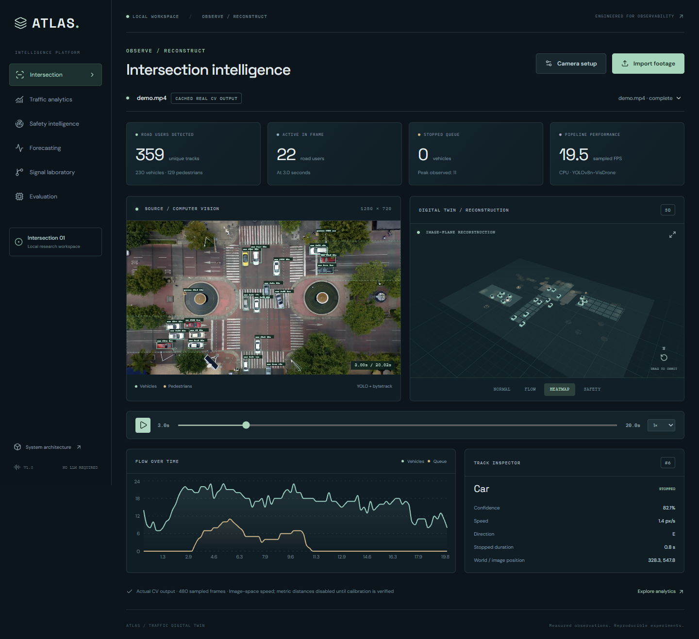
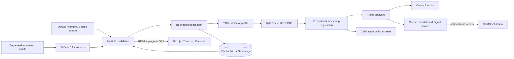

# ATLAS

**ATLAS 3.0 is in experimental development.** A connected official-camera → actual perception → uncertain state → explicit demand assumptions → matched SUMO → synchronized replay workflow now complements the original platform. Five-city sources, editable observation-bound road regions, durable cancellable jobs and an evidence laboratory are included. The new 3,617-parameter directional GNN measures **2.344 mph** five-minute METR-LA MAE versus the original **2.490**, a **5.85%** reduction on the shared historical holdout; it remains a highway-domain research model. City twins are **uncalibrated**, and the prototype controller is not promoted over the verified controller. [3.0 acceptance ledger](docs/atlas-3-status.md) · [Connected architecture](docs/atlas-3-architecture.md) · [Measured results](docs/atlas-3-results.md) · [Generated metrics](docs/VERIFIED_ENGINEERING_METRICS.md) · [Original 20 upgrades](docs/atlas-2-status.md) · [City sources and permissions](docs/city-data-sources.md). The public URLs below remain the previously verified deployment until a newer deployment is explicitly verified.

**AI-powered traffic digital twin and adaptive intersection intelligence.**

[Live Demo](https://atlas-mu-murex.vercel.app) · [GitHub repository](https://github.com/youssef061204/ATLAS) · [Connected architecture](docs/atlas-3-architecture.md) · [Live Benchmarks](https://atlas-mu-murex.vercel.app/benchmarks) · [AI Laboratory](https://atlas-mu-murex.vercel.app/laboratory) · [38-second walkthrough](artifacts/portfolio/v3/walkthrough.mp4)

The public Vercel experience is an interactive **precomputed real-data demo**: genuine CV output, synchronized trajectories, measured benchmark artifacts, actual recorded RESCO controller comparisons, and separately labeled historical controlled simulation. New CV processing and SUMO jobs remain available locally through the full Python/container backend. [Deployment architecture](docs/deployment.md).

Traffic footage becomes persistent object tracks, synchronized 3D replay, traffic analytics, calibrated conflict screens, and reproducible signal-control experiments. The complete platform runs locally without an LLM or API key.



**Real annotated traffic evaluation:** 4,260 frames across three complete, predeclared UA-DETRAC test sequences: **0.898 mAP@50**, **0.793 IDF1**, and **29.4 FPS** for the full CPU pipeline. METR-LA five-minute speed forecasting measured **2.490 mph MAE**, versus persistence **2.813**. These are scoped dataset results, not field trials. [Evaluation protocol and evidence](docs/real-world-evaluation.md).

## Measured evaluation

Real-world benchmarks (2026-10-05; Intel i7-14700HX, 15.71 GiB RAM, Windows, Python 3.11.9, CPU):

| Task | Dataset / scope | Metric | Measured ATLAS result |
|---|---|---|---|
| Detection | UA-DETRAC selected three-camera test subset; merged vehicles | mAP@50 / mAP@50:95 | 0.898 / 0.626 |
| Tracking | Same 4,260 frames; production ByteTrack; official TrackEval | IDF1 / HOTA / MOTA | 0.793 / 0.640 / 0.683 |
| Analytics | Annotated active vehicle count | MAE / RMSE | 1.302 / 2.016 vehicles |
| Forecasting | METR-LA, all 207 sensors, chronological test | 5 / 10 / 15 min ML MAE | 2.490 / 2.895 / 3.214 mph |
| Systems | Actual UA-DETRAC footage; full processing and persistence | FPS / inference p95 | 29.4 / 35.7 ms |
| Signal control | RESCO Cologne1 real-world-derived simulation; three held-out seeds | Mean delay (seconds) | ATLAS 66.45; fixed 57.45; max-pressure 37.99 |

**The original realistic ATLAS control result was worse:** 15.7% higher mean delay than fixed timing. Every seed and this negative finding remain visible. The max-pressure variant performs better; these are SUMO results under published demand, not an observed field intervention. Full provenance, settings, splits, per-camera scores, per-seed outputs, and [forecast plots](artifacts/benchmarks/plots/metr-la-5min.png) are in [benchmark artifacts](artifacts/benchmarks).

**The replacement is validation-selected MPC:** on ten new paired Cologne1 seeds, mean delay is **20.53 +/- 0.85 s**, versus fixed **59.88 s**, max-pressure **37.75 s**, and original ATLAS **66.67 s**. Mean paired reductions are **65.7% versus fixed** (95% bootstrap CI 64.7-66.6%) and **45.3% versus max-pressure** (42.7-48.3%), with 10/10 wins. Source legal phases, 3 s yellow and 2 s all-red constrain every action. This evaluation uses Linux SUMO 1.27.1; the CV numbers above retain their original Windows hardware scope.

**Limits remain visible:** untuned Ingolstadt1 transfer failed (MPC 40.08 s; fixed 37.95 s; max-pressure 28.16 s). Forecasting's separate ablation benefit was small and uncertain. These are simulated interventions under published demand, not field improvements or universal controller superiority. [Root-cause audit](docs/signal-control-audit.md) ? [Final results, ablations and reproduction](docs/signal-control-results.md) ? [Actual interactive SUMO replay](https://atlas-mu-murex.vercel.app/optimization).

Controlled benchmarks, retained separately:

| Task | Evaluation | Measured result |
|---|---|---|
| Signal search | Synthetic portable simulation, three held-out seeds | 37.5% mean delay reduction |
| Risk screening | Independent generated conflict scenarios | 0.974 AUROC; 0.824 AUPRC |
| Forecasting | Generated diurnal series, temporal holdout | Five-minute MAE 2.466 |
| Metric integration | COCO8 / analytic MOT fixtures | Integration checks, not traffic accuracy |

The separate archived real-video Mixkit run remains **19.5 sampled FPS** using the aerial profile; footage/model/settings differ from UA-DETRAC. Dataset evaluation uses untouched pretrained vision settings and chronological forecasting splits; control selects timings only on a disjoint tuning period. Physical speed, queues, calibrated real conflict accuracy, GPU performance, and live-camera transport remain unvalidated. Dataset rights and the limits of a three-camera subset are documented in the [technical report](docs/technical-report.md).


## Run it

Docker Desktop / Docker Compose is the shortest clean installation:

```sh
docker compose up --build -d
```

Open **http://localhost:3000**. API documentation: **http://localhost:8000/docs**. The bootstrap service downloads the attributed sample and restores a checksum-verified cache from an actual CV run. The workspace labels this **cached real CV output**. Upload a new video to run inference, or use **Camera setup → Save & reprocess** to rerun the sample.

First installation needs network access for images, Python/npm packages, and the 7.9 MB sample. No raw footage or weights are committed. Docker serves a production Next.js build and binds both ports to loopback. Stop with `docker compose down`; the named data volume remains.

**Native Windows** — Python 3.11, Node.js 24, and npm:

```powershell
powershell -ExecutionPolicy Bypass -File scripts/setup.ps1
.venv/Scripts/python scripts/dev.py
```

**Linux** — Python 3.11 and Node.js 24:

```sh
bash scripts/setup.sh
.venv/bin/python scripts/dev.py
```

Manual setup: create a Python 3.11 virtual environment, install `pip install -e '.[dev]'`, run `npm ci` in `frontend`, then `atlas demo --cached`. On Linux install the CPU PyTorch wheel first as shown in `scripts/setup.sh`. The supervisor starts the API and interface and cleans up its own child processes on Ctrl+C. Ports 3000 and 8000 must be free.

If the sample host is unavailable, start the application without the demo initialization and upload your own MP4, WebM, MOV, AVI, or MKV. Upload limit: 250 MB; maximum duration: 30 minutes. Long recordings require proportionally more memory and processing time.

## Explore

1. **Intersection:** synchronized video, detection boxes, persistent IDs, selectable 3D objects, flow trails, density heatmap, play/pause, scrubbing, and playback speed.
2. **Camera setup:** four road-plane control points, surveyed world coordinates, polygon regions, detector profile, resolution, sampling, confidence, and tracker. Saving reprocesses the source.
3. **Analytics:** observation-derived class counts, speed trends, queue length, stop duration, dwell time, region occupancy, and intersection exits.
4. **Safety:** verified calibration enables constant-velocity TTC/separation, path-crossing PET proxies, hard-braking screens, and source-video event replay. Anonymous track IDs; no identity inference.
5. **Forecast:** causal source forecasts require at least 15 minutes of history. A separate page shows held-out synthetic ML experiments at 5/10/15-minute horizons and baseline comparisons.
6. **Signal laboratory:** click **Optimize intersection**. Replay fixed, adaptive, and constrained-search policies under identical seeded arrivals. Compare live and complete-run delay, queues, stops, throughput, and pedestrian wait.
7. **Evaluation:** separate real-world and controlled sections load measured detection, tracking, count errors, forecast plots, real-video performance, and four-controller RESCO comparisons with raw JSON links.

The sample is an overhead **time-lapse** of Guadalajara from [Mixkit #1755](https://mixkit.co/free-stock-video/city-busy-traffic-intersection-time-lapse-1755/). Its time axis is playback time. Pixel-motion metrics are useful for reconstruction; they are **not physical speeds or field arrival rates**. Do not verify its calibration without surveyed points and a known source time scale. See [dataset notes](docs/datasets.md).

## Architecture



Python keeps inference and numerical analysis in one service; a bounded process pool isolates expensive CV from API handling. SQLite WAL and local files provide a portable persistence layer with migrations and run-scoped identifiers. There is no decorative event bus or untested external database dependency. See [architecture](docs/architecture.md) and [technical report](docs/technical-report.md).

## Reproduce results

For the new real-data suite: `pip install -e '.[evaluation]'`, then `python scripts/prepare_real_data.py` and `python scripts/evaluate_real.py`. The latter runs every prepared dataset and skips absent datasets; it never downloads implicitly. `--reuse` accepts only checksum/configuration-matched vision predictions. Run `python scripts/standardize_benchmarks.py` and `python scripts/export_artifacts.py` to refresh normalized original results, CSV, and exactly three resume bullets. Make targets and dataset-specific commands are documented in [real-world evaluation](docs/real-world-evaluation.md).

Activate the virtual environment first. Windows equivalents use `.venv/Scripts/atlas` and `.venv/Scripts/python`.

```sh
atlas demo                             # fresh aerial CV inference
atlas process path/to/traffic.mp4 --camera-config docs/demo-camera.json
atlas benchmark path/to/traffic.mp4     # defaults to COCO profile
atlas evaluate                         # risk + forecast + simulation
atlas evaluate --only risk
atlas evaluate --only forecast
atlas evaluate --only simulation
atlas evaluate --only cv                # COCO8 smoke evaluation, four validation images
pip install -e '.[evaluation]'
atlas evaluate --only tracking --gt ground-truth.csv --pred tracks.csv
python scripts/verify_tracking_metrics.py
python scripts/verify_live.py            # actual HTTP upload + camera reprocessing; API running
python scripts/benchmark_streams.py data/demo.mp4
python scripts/load_test.py             # API must be running
python scripts/export_artifacts.py      # CSV + measured resume bullets
```

Optional independent SUMO cross-check:

```sh
pip install eclipse-sumo==1.27.1
python scripts/benchmark_sumo.py --seed 42
```

`Makefile` provides equivalent `make evaluate`, `make benchmark-cv`, `make benchmark-tracking GT=... PRED=...`, `make benchmark-risk`, `make benchmark-forecast`, and `make benchmark-simulation` targets. Artifacts carry scope, seeds, timing, and environment metadata. [Resume bullets](docs/resume-bullets.md) are generated from measured artifacts.

## Verify

```sh
pytest -q
ruff check backend scripts
ruff format --check backend scripts
python -m compileall -q backend
cd frontend
npm run lint
npm run typecheck
npm run format:check
npm run build
npx playwright install chromium
npm test
```

Full browser integration requires a running API and processed demo. CI runs CPU unit/API tests, formatting/lint/type checks, production build, and browser smoke tests. Expensive evaluations are available through workflow dispatch. [Verification record](docs/verification.md) distinguishes performed checks from optional paths.

[Portfolio walkthrough](docs/demo-flow.md), [recorded application demo](artifacts/demo/atlas-walkthrough.webm), and [technical report](docs/technical-report.md) accompany the implementation.

## Configuration and limits

`.env.example` lists environment variables; export the backend values in your shell or set them in Compose. Next.js browser configuration goes in `frontend/.env.local`. CUDA is optional: install the matching PyTorch build and set `ATLAS_DEVICE=cuda:0`. GPU performance is unmeasured here. Stream capture is disabled by default; enable only for trusted local sources with an explicit hostname allowlist. A browser webcam can be recorded as WebM and uploaded.

The platform is a **research demo**, not a certified traffic-control or safety system. Detection/tracking is measured on the declared UA-DETRAC subset; broad deployment-domain accuracy and calibrated conflict accuracy remain unmeasured. COCO8 is a smoke check, not a traffic benchmark. Synthetic risk AUROC and forecasting scores are labeled synthetic. Track fragmentation can inflate counts. The portable simulator models protected straight-through, single-lane traffic; it does not model turns, full vehicle geometry, or urban network spillback. The SUMO cross-check has its own documented scope.

Video and results remain in `data/` (or the Docker volume) until the operator removes them. No facial recognition, cross-camera person identification, hosted uploads, or external LLM calls. The default API is a trusted local workspace, without public authentication. Read [API/security](docs/api.md) before exposing it beyond loopback.

Source code is AGPL-3.0. The aerial model has its own [pinned upstream model card](https://huggingface.co/dronefreak/visdrone-yolov8n/tree/b5ca8d362341457ad715a5314da0931ea58bb237); sample footage is governed by the [Mixkit Stock Video Free License](https://mixkit.co/license/). Source assets remain separately licensed.
