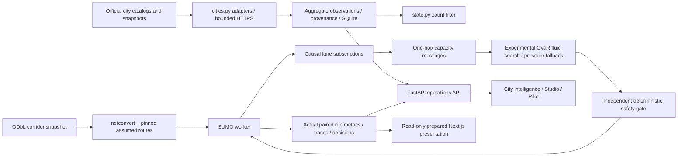

# ATLAS 2.0 incremental architecture

ATLAS 1.0 remains the production reference. The 2.0 components are experimental advisory research software, not certified municipal control.

**There is intentionally no camera-count → traffic-demand arrow.** Infrequent snapshots do not establish flow, turns, lane queues or trajectories. The scalar count filter exposes its uncalibrated prior and intervals. `calibrate_scale` is a validated numerical primitive; no municipality is yet calibrated with independent counts.

Native processing remains FastAPI → bounded process executor → YOLO/ByteTrack → SQLite/results. Historical `control.py`, `signal_lab.py`, frozen selection and all original benchmark JSONs remain unchanged. New network runs use `evaluation/network_v2.py` and `control_v2.py`; output namespaces and protocols are distinct.

The operations API adds official-source records, network manifests, experimental comparisons, aggregate state estimates, authenticated ingestion, queued simulation jobs and approval/rejection/rollback audit entries. Simulation jobs share the existing process executor, with a two-job admission limit. Source refresh uses two slots and a per-city interval persisted across restarts. No hardware actuation interface exists.

Public preparation copies aggregate source records and completed experiment evidence into static assets. Public APIs redirect only to those assets; write actions remain unavailable. Vercel still executes no Python/CV/SUMO jobs. No new public deployment is implied by this working increment.

Boundaries still missing: continuous calibrated detector assimilation, regional optimization, actual transit demand, robust city forecasting, multi-tenant authorization and durable distributed simulation scheduling. Camera image bodies are processed in memory; persistent records are aggregate-only.
