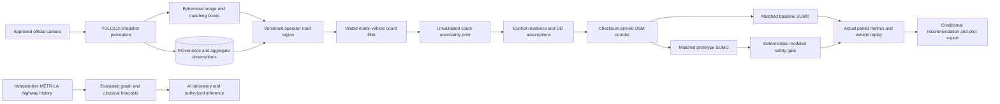

# ATLAS 3.0: connected research platform

This increment preserves the original published ATLAS benchmarks and the frozen v2 study. Its city twin is **exploratory, not independently field-calibrated**. The native application executes new CV and SUMO jobs. The public application replays genuine saved outputs and refuses operational writes. Neither path controls traffic hardware.

The highway forecasting experiment remains separate from the city camera pipeline. Its sensor speeds are not relabeled as intersection queue predictions. Historical Toronto counts are also separate: their July 2025 measurement date does not match the new camera snapshots. The application does not fuse mismatched timestamps or infer current arrivals from the historical totals.

## Observation and geometry

Five official adapters use HTTPS allowlists, bounded payloads, timeouts, retry/backoff and source-specific refresh intervals. A snapshot supplies class counts and normalized bounding boxes, not continuous tracks, speeds, turns or queues. Capture time remains unknown when the source does not establish it; HTTP modification time is a separate proxy. Image scores are model confidence, not measured correctness.

An authorized fresh observation returns its actual image and corresponding boxes with `Cache-Control: no-store`. Images are not written into the operations database or published benchmark artifacts. Scene corrections bind a normalized polygon, imported road ID and version to the exact source observation. Applying a correction filters detections by their bottom-center point, updates the visible-count estimate and invalidates the previous paired result. Reusing a polygon from an older observation is refused until the operator verifies it again.

Camera coordinates generate nearest road-polyline candidates. A 1 km maximum distance screens unrelated sources before demand-conditioned jobs. This generous proximity bound is an engineering guard, not a validated camera field-of-view model. Cameras within it still require independent heading, lane and survey verification. Selecting another camera or city clears displayed observations and experiments rather than substituting Toronto evidence.

`scene.py` additionally implements a finite, conditioned planar homography and a continuous-video queue candidate with stopped/slow/flowing states and dwell time. Those primitives require operator geometry and valid motion history. There is no independently annotated physical queue accuracy result; isolated snapshots cannot use them.

## Conditional simulation

`intelligence.py` converts estimated visible motor vehicles into assumed arrivals using a user-selected residence time and multiplier. It samples paths from the pinned generated route template, preserves vehicle types, records net/route hashes and refuses zero observed motor demand or an excessive vehicle budget. OD paths and signal timing remain assumptions.

Both controllers receive identical routes, initial conditions, duration and seed. Results retain every actual metric, source observation, assumptions and controller trace. The newer harness also records actual SUMO vehicle longitude/latitude and speed for synchronized replay. The earlier golden experiment and its exact source remain archived; adding positions did not alter its measured delays.

The prototype is a bounded risk-aware MPC with graph messages, explicit modeled clearance constraints and topology-triggered pressure fallback. The frozen nominal evaluation shows several regressions against the original MPC. It is a research comparator rather than an automatic replacement. Modeled lamp-state checks are not agency conflict-survey validation or safety certification.

## Learning and evidence

The new 3,617-parameter directional graph neural forecaster learns local, upstream and downstream messages across the 207-sensor METR-LA graph. A matched local temporal MLP and graph-assisted classical boosting provide comparators. Fixed protocols, training-only statistics, chronological splits, source hashes, validation-selected epochs, all evaluated horizons and paired calendar-day intervals are published. One training seed and a shared historical test period limit the inference; independent replication remains outstanding.

Native forecast endpoints verify trusted local checkpoints and context checksums, accept finite source-ordered causal histories, and do not load uploaded pickle or model files. The GNN uses weights-only checkpoint loading. Missing models return an explicit unavailable response. The laboratory exposes recorded forecast series, detector regressions and annotated virtual-line counts. Experimental models are not automatically promoted or retrained.

## Runtime and recovery

FastAPI uses the existing process executor with at most two admitted simulation jobs. A top-level picklable wrapper persists queued, running, completed, failed, cancelled or interrupted state in SQLite WAL. Cancellation sets a durable flag checked every five simulation steps; simulator child processes close in `finally`. At API restart, unfinished work is marked interrupted and is not silently rerun. Completed results remain inspectable. This recovery model requires **one API owner per operations database**; it is not a distributed queue.

Operator keys stay in request headers and temporary client memory, clear after submission, and are not stored with jobs. Public Vercel mode rejects writes. Current refresh/perception limits are process-local for direct camera observations; multi-process/distributed admission, organizational identity and service-level availability guarantees are not established.

## Product structure

The five primary areas are Cities, Digital Twin, Optimization Studio, AI Laboratory and Pilot Builder. Existing continuous-video, analytics, safety, forecast and benchmark routes remain available. A guided source-to-result workflow exposes provenance and assumptions before a run, then links its exact result to synchronized replay and an evidence-aware pilot export. A single paired run cannot inherit confidence intervals from the unrelated twenty-seed cohort.

See [acceptance ledger](atlas-3-status.md), [reproduction and results](atlas-3-results.md), [generated metrics](VERIFIED_ENGINEERING_METRICS.md) and the retained [v2 ledger](atlas-2-status.md).
