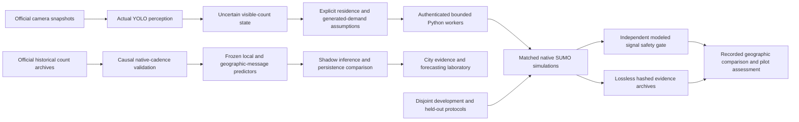

# ATLAS 4.0 connected architecture

The existing application and historical controllers remain intact. The [3.0 architecture](atlas-3-architecture.md), [acceptance ledger](atlas-3-status.md) and original benchmarks remain independently inspectable.

Historical counts and current snapshots are separate branches. No synchronized multimodal fusion or independent field calibration is inferred. A camera's visible stock does not become a measured arrival flow. Toronto's municipal turning records are exported with provenance, but historical approach labels still require surveyed mapping to the modeled network.

The city runtime validates source registry, site/direction, clock basis and three contiguous count intervals. Model and feature sources, registered protocol, input archives and trusted local checkpoint digests must agree. Neural checkpoints use weights-only loading; joblib files are restricted to operator-provisioned trusted paths. Request bodies cannot supply model paths. Models remain shadow candidates; validation/test regressions and causal history drift flags are retained. Drift heuristics are not independently calibrated out-of-distribution probabilities.

The cached MPC removes repeated movement/topology calculations and batches beam expansion while retaining the frozen original's neutral objective and legal actions. Experimental queue, horizon and coordination variants did not satisfy development regression guards. Its computational benefit does not imply improved traffic outcomes relative to the original MPC. The cooperative Q policy has five four-city training rotations, frozen before fifth-city nominal evaluation; it remains experimental because transfer regresses in Toronto and London. The learned queue surrogate fails persistence in every held-out city and is excluded from counterfactual ranking.

Native workers batch actual TraCI vehicle subscriptions. The exact benchmark harness stays frozen. An isolated native serialization adapter marks non-finite replay coordinates unavailable, keeps their field paths and refuses non-finite measured metrics. Maps omit unavailable coordinates. No signal decision or simulator physics changes during telemetry recovery.

The separate vehicle-metric audit found invalid negative CO2/fuel integrals in one Austin high-demand actuated episode. Its frozen raw values remain inspectable; emissions, potentially contaminated stops and affected aggregates are unsupported. Native workers return unavailable values with the original invalid measurements retained. Delay and completion use separate SUMO trip outputs. See the [measurement-quality ledger](../artifacts/cities/v4/measurement-quality.json).

The public Next.js deployment serves a read-only subset of genuine processing and research outputs. The optimization replay contains the first registered nominal seed, while tables retain all twenty seeds. A separate compact assessment artifact retains all matched seed inputs and bootstrap delay intervals; raw episodes remain on GitHub. Public selections do not execute Python CV, SUMO, neural training or signal hardware commands. Native job submission requires configured operator authentication, bounded process workers and source permissions.

Existing Vercel hosting remains suitable for the frontend and recorded responses. New public simulation service guarantees are not established. A supervised remote pilot would require an authorized persistent container worker, pinned SUMO/native dependencies, a durable queue and database, private model storage, TLS/CORS restricted to approved operator domains, job quotas, cancellation and retention controls. CPU jobs can start without a GPU; actual deployment cost and concurrent-load capacity require a measured workload and selected hosting contract. No paid backend has been provisioned or operational service-level guarantee claimed.

The public and native user journeys share five-city selection, official source provenance, historical forecast evidence, paired replay, controller explanations and downloadable pilot assessments. Automated interaction and accessibility results are distinct from human comprehension. Field counts, queues, travel times, agency signal timing/conflict surveys, natural adverse-weather holdouts and human task studies remain acceptance boundaries.

Reproduction: [data adapters and licenses](atlas-4-data.md), [frozen control protocol](control-v4-frozen.json), [measured results](atlas-4-results.md), [all raw evidence](../artifacts/cities/v4), `scripts/verify_v4_evidence.py` and the GitHub verification workflow.
