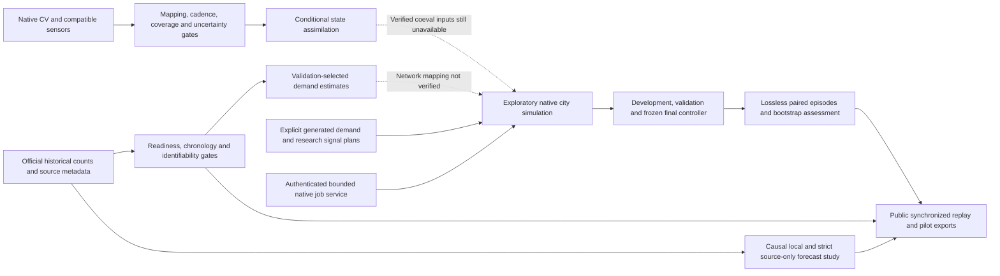

# ATLAS 5 connected evidence architecture

ATLAS 5 extends the existing Python/FastAPI/SQLite, SUMO and Next.js/Three.js
architecture. It preserves original policies, native CV processing and all frozen
historical artifacts. The public frontend uses actual precomputed outputs; the
native backend is not represented as a Vercel runtime.

The dotted edges show unfulfilled real-data acceptance gates, not active validated
connections. Count profiles are not substituted for physical queue truth. Image
counts are not relabeled as arrival rates, and proximity graphs are not surveyed
directed flow graphs. Forecast candidates remain experimental and do not alter
production signal decisions.

`calibration_v5.py` estimates nonnegative identifiable OD quantities only with a
verified incidence matrix. Existing city data does not supply that matrix, so
the actual five-city experiment estimates channel demand profiles instead.
`assimilation_v5.py` accepts compatible physical measurements and explicit
variances, rejects unavailable mappings/coverage/timing, avoids overlapping camera
double-counting, and handles detector disagreement and outages. Empirical city
fusion benefit remains blocked by absent contemporaneous calibrated inputs.

`city_forecast_v5.py` uses causal scale ratios, source-only model selection and
validation interval calibration. Published local, strict leave-one-city-out and
proximity ablation results include every failed candidate. The stronger existing
highway GNN retains its separate domain and checkpoint.

`control_v5.py` selects cached MPC or max-pressure from current inbound/downstream
occupancy, with hysteresis, dwell constraints and independent safety masking. It
does not inspect city identity, seed, scenario labels, future arrivals or final
outcomes. `control-frozen.json` pins source and validation choices before final
seeds. The worst-episode guard failed; existing policies remain unchanged.

`execution_v5.py` provides a private, disabled-by-default job service. One supervisor
owns durable SQLite quota/job state and one bounded subprocess per paired native
experiment. Source fingerprints, parameters and network manifest define reproducible
experiment identities; actual outputs include matched route/network hashes.
Authentication is account-specific; credentials never enter the public frontend.
Cancellation and resource monitoring affect only owned children. Public hosting
security/cost prerequisites are documented in [execution architecture](execution-v5.md).

`prepare-demo.mjs` publishes only city-specific actual replay payloads, full-seed
pilot summaries, count series, calibration metadata and forecast results. Large
lossless benchmark bundles belong in GitHub evidence and are excluded from Vercel
uploads. Vercel serves the landing, workspace, validation, benchmarks and interactive
saved comparisons without Docker, Python, SUMO, a GPU, authentication or local data.

ATLAS 4 browser measurements remain tied to the exact archived frontend bytes in
`artifacts/cities/v4/ux-measured-source.zip`. New performance/accessibility measurements
have their own ATLAS 5 provenance. Neither automated browser checks nor simulated
signal constraints certify commercial or field readiness.
